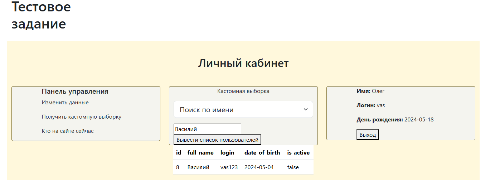

# ТЗ

## Установка

Данный проект запускается на любом локальном сервере.

## 1 Создание БД.

Для создания бд использовать команду:

    CREATE DATABASE IF NOT EXISTS DB_test CHARACTER SET utf8 COLLATE utf8_general_ci;

    USE DB_test;
    
    CREATE TABLE Users (
    id INT AUTO_INCREMENT PRIMARY KEY,
    full_name VARCHAR(255) NOT NULL,
    login VARCHAR(100) UNIQUE NOT NULL,
    password VARCHAR(225),
    date_of_birth DATE,
    is_active VARCHAR(20)
    );

### Запуск в openserver

Как запускал я? Использовал OpenSerever. В папку с C:\ospanel\domains\DB закинул домен DB.
Далее -> запустить сервер -> запустить проект.
В модулях исользовал HTTP - Apache_2.4-PHP_8.0-8.1, PHP_8.0, MySql-8.0-Win10.
Другие модули - "Не использовать".

### Подключение к бд

Для доступа к базе данных нужно установить логин "root" и пароль "mysql" на локальном сервере.

Если PhpMyAdmin от Openserver можно перейти на http://127.0.0.1/openserver/phpmyadmin/index.php и на главной странице
"Основные настройки"->"Изменить пароль"

Либо же в файле Connect.php, находящимся по пути DB/Connect.php относительно
корневой папки проекта поменять в массиве static protected $dsnData:

- значение для 'host' => 'localhost'. Установить свое название сервера (вместо localhost).

- значение для 'user' => 'root'. Установить свое имя пользователя (вместо root).

- значение для 'passwd' => 'mysql'. Установить свой пароль (вместо mysql).

## Использование.

Запустив локальный сервер перейти по адресу http://db/index.php или  http://db/.

Кнопка "Записать" - записывает данные из categories.json в таблицу "header" базы данных DB.
Кнопка "Удалить" - удаляет все записи из таблицы "header".

## Описание Классов.

Класс Connect - отвечает за конект к бд.

Класс Calls - вызывает основные методы.

Класс Sql - содержит методы для работы с бд.

Класс IsOnline - менять статус пользователя - false (не онлайн), true (онлайн).

## Добавление пользователей.

Пользователи добавляются в бд через Post метод формы класса index (здесь регистрация) или
Auth (здесь авторизация). Данные с этих форм обрабатываются в классе Calls.

## Редактирование данных.

Для редактирования данных пользователя перейти в личный кабинет.

К примеру меняеи имя "Василий" на "Олег"

Данные берутся с инпут полей. Далее все выбранные импут поля через ajax передаются POST запросом на
Call.php далее вызываются sql методы обрабатывающие запрос.

## Выборка по кастомному фильтру

В выпадающем меню выбрать имя или логин далее ввести интересующее значение. Далее получить результат

Принцип работы аналогичен с редактированием данных.

## Кто онлайн на сайте

При регистрации или авторизации пользователю дается статус is_online = true.
При выходе из личного кабинета стаутс is_online = false.

## Выгрузка в csv

Выгружает текущих "онлайн" пользователей в CSV файл [online.csv](DB/online.csv)

